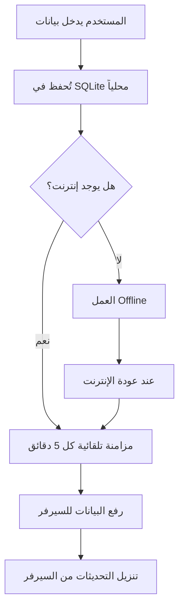

# 🔄 دليل نظام المزامنة التلقائية - Offline First

## 📋 نظرة عامة

هذا النظام يسمح للتطبيق بالعمل **offline** بالكامل، مع مزامنة تلقائية كل 5 دقائق عند توفر الإنترنت.

---

## ✨ المميزات

- ✅ **Offline First**: التطبيق يعمل حتى بدون إنترنت
- ✅ **مزامنة تلقائية**: كل 5 دقائق (قابل للتخصيص)
- ✅ **Service Worker**: دعم PWA وكاش ذكي
- ✅ **Background Sync**: مزامنة في الخلفية عند عودة الإنترنت
- ✅ **فحص سريع**: API لا يتطلب اتصال بالسيرفر

---

## ⚙️ الإعدادات (.env)

```env
# المزامنة التلقائية
AUTO_SYNC_ENABLED=true
AUTO_SYNC_INTERVAL=300  # بالثواني (300 = 5 دقائق)

# قاعدة البيانات المحلية (SQLite)
SYNC_LOCAL_CONNECTION=sync_sqlite
SYNC_SQLITE_PATH=C:\xampp\htdocs\pos\database\sync.sqlite

# السيرفر البعيد (اختياري للـ offline mode)
ONLINE_URL=https://your-server.com
SYNC_API_TOKEN=your_token_here
SYNC_VIA_API=true

# وضع التطبيق
APP_ENV=production  # مهم: يجب أن يكون production لاستخدام MySQL
```

---

## 🚀 طرق تشغيل المزامنة التلقائية

### 1️⃣ **باستخدام Batch File (أسهل طريقة)**

شغّل الملف:
```batch
start-auto-sync.bat
```

هذا سيشغل المزامنة كل 5 دقائق. اترك النافذة مفتوحة.

---

### 2️⃣ **باستخدام Laravel Scheduler (الأفضل للإنتاج)**

شغّل الـ scheduler:
```batch
php artisan schedule:work
```

أو أضفه لـ Task Scheduler في Windows:
1. افتح **Task Scheduler**
2. **Create Basic Task...**
3. الاسم: `POS Auto Sync`
4. Trigger: **When the computer starts**
5. Action: **Start a program**
   - Program: `C:\xampp\php\php.exe`
   - Arguments: `artisan schedule:work`
   - Start in: `C:\xampp\htdocs\pos`

---

### 3️⃣ **مزامنة يدوية (من الواجهة)**

1. اذهب إلى: `/sync-monitor`
2. اضغط على: **🌐 فحص الاتصال**
3. إذا كان السيرفر متاح، اضغط: **📥 مزامنة من السيرفر**

---

### 4️⃣ **مزامنة يدوية (من Terminal)**

```batch
# مزامنة عادية (تحترم المؤقت)
php artisan sync:auto

# فرض المزامنة الآن (تجاوز المؤقت)
php artisan sync:auto --force
```

---

## 🔍 فحص حالة النظام

### من الواجهة:
```
http://127.0.0.1:8000/sync-monitor
```

اضغط على **🌐 فحص الاتصال** لمعرفة:
- ✅ قاعدة البيانات المحلية
- ✅ حالة الإنترنت
- ✅ حالة السيرفر البعيد
- ✅ وقت آخر مزامنة

### من API:
```batch
curl http://127.0.0.1:8000/api/sync-monitor/check-health
```

الاستجابة:
```json
{
  "success": true,
  "system_status": {
    "mode": "offline-first",
    "local_database_available": true,
    "internet_available": true,
    "remote_server_available": false,
    "auto_sync_enabled": true,
    "last_sync": "2026-01-18 17:00:00",
    "next_sync": "2026-01-18 17:05:00"
  }
}
```

---

## 📊 كيف يعمل النظام؟



---

## 🛠️ استكشاف الأخطاء

### المشكلة: "السيرفر غير متاح"

**الحل:**
- ✅ التطبيق يعمل offline - لا مشكلة!
- البيانات تُحفظ محلياً في SQLite
- عند عودة الإنترنت، ستتم المزامنة تلقائياً

---

### المشكلة: "قاعدة البيانات المحلية غير متاحة"

**الحل:**
```batch
# تهيئة SQLite
php artisan migrate --database=sync_sqlite

# أو من الواجهة
http://127.0.0.1:8000/sync-monitor
# اضغط على "تهيئة SQLite"
```

---

### المشكلة: "المزامنة التلقائية لا تعمل"

**تحقق من:**
1. `.env`:
   ```env
   AUTO_SYNC_ENABLED=true
   ```

2. الـ Scheduler يعمل:
   ```batch
   php artisan schedule:work
   ```
   أو
   ```batch
   start-auto-sync.bat
   ```

3. عرض آخر محاولة:
   ```batch
   php artisan sync:auto
   ```

---

## 📁 الملفات المهمة

```
pos/
├── app/
│   ├── Services/
│   │   ├── AutoSyncService.php      # خدمة المزامنة التلقائية
│   │   ├── ApiSyncService.php       # خدمة الاتصال بالسيرفر
│   │   └── DatabaseSyncService.php  # خدمة المزامنة بين SQLite و MySQL
│   ├── Console/Commands/
│   │   └── AutoSyncCommand.php      # أمر المزامنة اليدوي
│   └── Console/Kernel.php           # جدولة المزامنة التلقائية
├── routes/
│   └── api.php                      # API Endpoints
├── public/
│   └── sw.js                        # Service Worker (PWA)
├── database/
│   └── sync.sqlite                  # قاعدة البيانات المحلية
├── .env                             # الإعدادات
├── start-auto-sync.bat              # سكربت تشغيل المزامنة
└── OFFLINE-SYNC-GUIDE.md            # هذا الملف
```

---

## 🔗 API Endpoints

```
GET  /api/sync-monitor/check-health        # فحص سريع (offline-first)
POST /api/sync-monitor/auto-sync           # تنفيذ المزامنة التلقائية
POST /api/sync-monitor/force-sync          # فرض المزامنة الآن
GET  /api/sync-monitor/sync-health         # فحص شامل (يحتاج اتصال)
```

---

## 📞 الدعم

إذا واجهت أي مشكلة:

1. تحقق من Logs:
   ```batch
   tail -f storage/logs/laravel.log
   ```

2. شغّل المزامنة يدوياً لمعرفة الخطأ:
   ```batch
   php artisan sync:auto --force
   ```

3. تحقق من حالة النظام:
   ```
   http://127.0.0.1:8000/sync-monitor
   ```

---

## ✅ خلاصة

- ✅ التطبيق يعمل **offline** بدون مشاكل
- ✅ المزامنة تلقائية كل **5 دقائق**
- ✅ لا حاجة لتدخل المستخدم
- ✅ البيانات آمنة ومحفوظة محلياً
- ✅ مزامنة سلسة وشفافة

---

**🎉 استمتع بنظام offline-first قوي وموثوق!**
